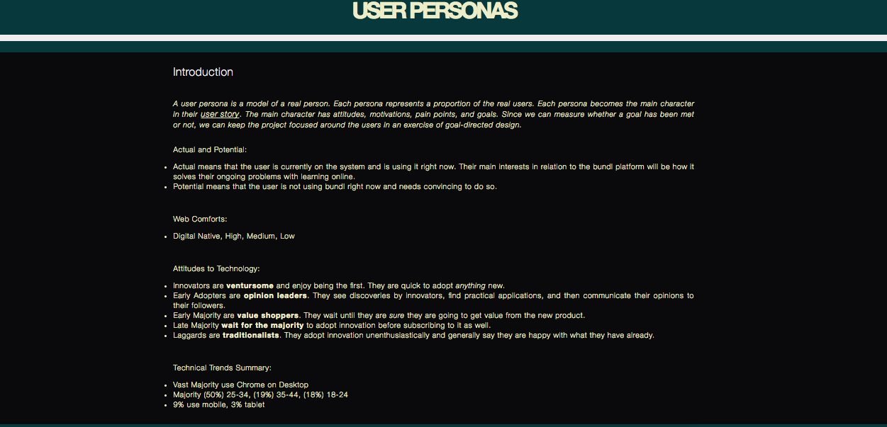
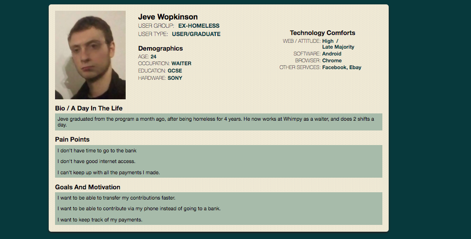

# UX

## Link to our pages: https://authosaurus.github.io/ux-project/public

This is design only for mobile.

## Project Learning objectives
- client interactions
- design flow
  * user personas
  * user stories
  * user journies
  * storyboard
  * prototyping
  * user testing
- new technologies:
  * figma - prototyping
  * invision - for user testing

## WHAT

Payment tracker web application for a charity (Harbingers of Hope) that assists the homeless in providing services which ultimately lead to them finding work.

## Inital notes from client meeting

The client is a charity combatting homelessness. It helps homeless people get back on their feet. Once working they then make contributions back to the charity’s running costs. The client currently tracks these contributions on a paper-based system. The client is looking for a more efficient system to reduce time spent on admin and allow them to scale.
There will be two types of users: admin (the charity’s staff) and contributors (people previously on the scheme).
Contributors will be given an account through which they can make contributions and see previous payments. They will be able to track their progress towards their contribution target.
Admin staff will be able to see an overview of all contributions, view the contribution details of individual contributors and manually log payments against a contributor where they are made outside the system (e.g. via cheque).

## User personas

A user persona is a model of a real person. Each persona represents a proportion of the real users. Each persona becomes the main character in their user story. The main character has attitudes, motivations, pain points, and goals. Since we can measure whether a goal has been met or not, we can keep the project focused around the users in an exercise of goal-directed design.

Examples

## Mock ups

Our mock ups can be viewed [here](https://www.figma.com/file/K2l7vXj5x891U50xOMaNJxOp/harbingers-of-hope).

## User stories

### Contributor

Contributors are unlikely to have good technical skills or reliable access to fast internet and modern browsers. We made the assumption (based on our discussion with the client) that many contributors would access the site on low-powered smartphones. Therefore we designed the app to have a simple interface that would load quickly.

Contributors are using the app in order to make contributions and see an overview of their total contributions. Therefore after logging in their are taken to an overview page, which has a graphical summary of their total contributions, a prominent button to make a new contribution and a list of each contribution.

Making a contribution is a one-step process of filling out payment details on a single page. Following feedback from user testing we added a confirmation page after payment. This is to provide reassurance that the payment went through with the correct amount etc. This page includes social media sharing links as these were also raised in user testing.

### Administrators

Administrators will access the app to see an overview of all contributions and to be able to register contributions from  particular individuals. On logging in they are taken to a page with a graphical summary of all contributions with a more detailed breakdown against monthly targets (as requested by the client). There is a button to view contributors, which shows a filterable and searchable list of all contributors. Clicking on a particular contributor will take the admin to a page where they can register contributions from that contributor. There is also the option to add a new user.

The intention with this design was to allow admin staff to have a clean overview page with the option to drop down into further detail for individual contributors.
