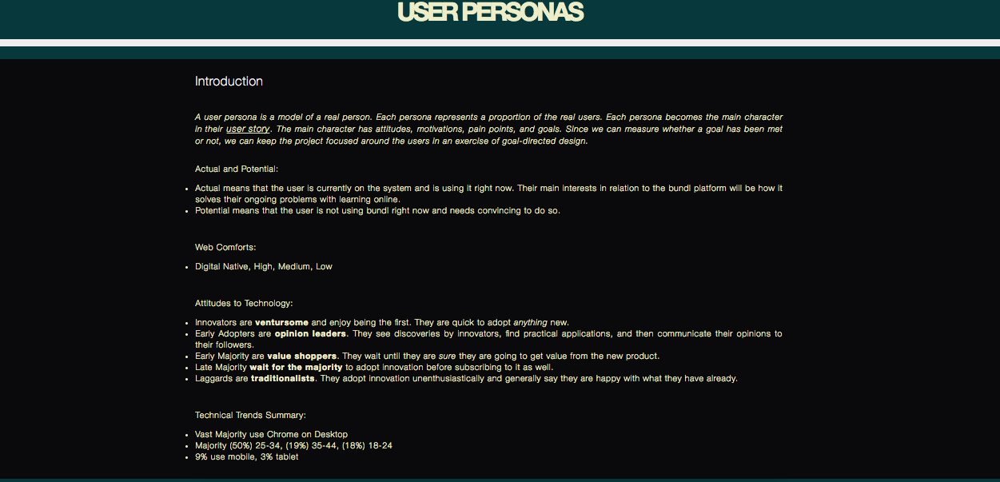
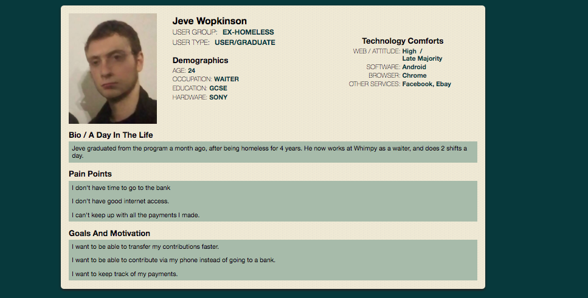

# UX

## Project Learning objectives
- client interactions 
- design flow
  * user personas
  * user stories
  * user journies
  * storybaord
  * prototyping
  * user testing
- new technologies:
  * figma - prototyping
  * invision - for user testing

## WHAT

Payment tracker web application for a charity (Harbingers of Hope) that assists the homeless in providing services which ultimately lead to them finding work. 

## Inital notes from client meeting

The client is a charity combatting homelessness. It helps homeless people get back on their feet. Once working they then make contributions back to the charity’s running costs. The client currently tracks these contributions on a paper-based system. The client is looking for a more efficient system to reduce time spent on admin and allow them to scale.
There will be two types of users: admin (the charity’s staff) and contributors (people previously on the scheme).
Contributors will be given an account through which they can make contributions and see previous payments. They will be able to track their progress towards their contribution target.
Admin staff will be able to see an overview of all contributions, view the contribution details of individual contributors and manually log payments against a contributor where they are made outside the system (e.g. via cheque).

## User personas

A user persona is a model of a real person. Each persona represents a proportion of the real users. Each persona becomes the main character in their user story. The main character has attitudes, motivations, pain points, and goals. Since we can measure whether a goal has been met or not, we can keep the project focused around the users in an exercise of goal-directed design.

Examples

## User stories

